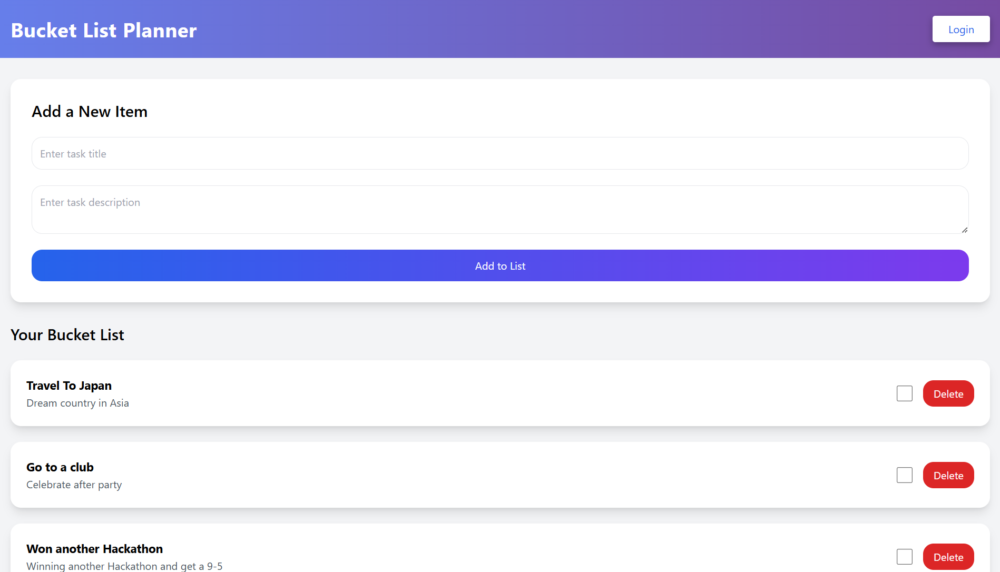

# Bucket List Planner

A simple and interactive web application to manage your bucket list tasks. This application allows users to add, mark as completed, and delete tasks from their bucket list.

## Features

- **Add Tasks**: Add a new task with a title and description.
- **Mark as Completed**: Check off tasks that you have completed.
- **Delete Tasks**: Remove tasks from your bucket list.
- **Animations**: Smooth fade-in animations and hover effects.
- **Responsive Design**: Optimized for mobile and desktop views.

## Tech Stack

- **Frontend**: HTML, CSS (TailwindCSS)
- **Animations**: CSS Keyframes for smooth transitions and hover effects
- **JavaScript**: For interactivity (adding, completing, and deleting tasks)

## Installation

1. Clone the repository to your local machine:

   ```bash
   git clone https://github.com/yourusername/bucket-list-planner.git
   ```

2. Open index.html in your web browser.
   Alternatively, you can host the application using a local server or deploy it using platforms like GitHub Pages or Netlify.

## Usage

1. Open the application in your browser.
2. Add a new task by entering a title and description in the provided form.
3. Once added, your task will appear in the task list.
4. You can mark tasks as completed by checking the checkbox, which will strike through the task.
5. Delete tasks by clicking the red "Delete" button.

## Image Example




## File Structure

    bucket-list-planner/
    |
    |
    |── index.html          # Main HTML file
    |── README.md           # Project documentation
    └── style.css           # Custom CSS file (if needed)

## Customization

You can easily customize the colors, fonts, and overall look of the application by modifying the TailwindCSS configuration or the custom CSS styles.

## License

This project is open source and available under the MIT License.

Feel free to replace placeholders like `yourusername` with your actual GitHub username and adjust the structure if needed!
    